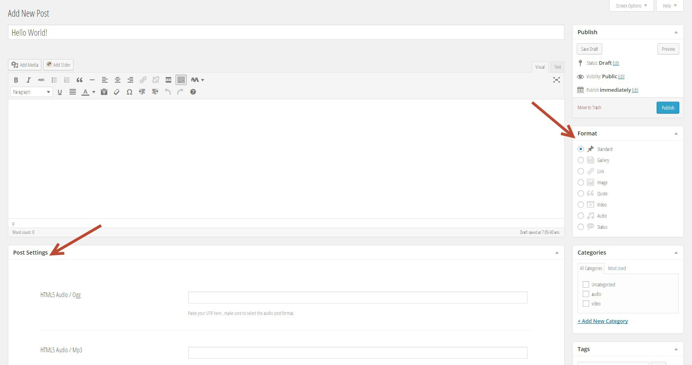
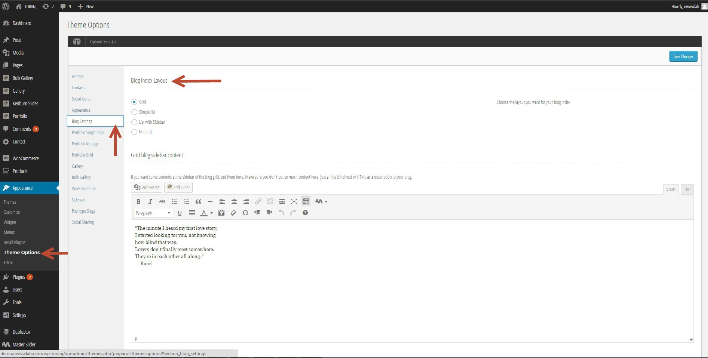

# Setup your Blog

Here we are going to take look into available post types, different blog layouts and required settings.

### Various available post types

There is 8 different post type available in Toranj. Each one of theme has it's own settings and meta field that must be field in "Post settings" section.



Toranj has 8 different blog post type

#### List of all available post types and meta fields

*   **Standard**
    
    This is standard post without any header
    
*   **Image**
    
    Post with image header. image must be set in "Featured image" box.
    
*   **Video**
    
    post with embed video header. The video must be entered as iframe in "Embed Video" filed of "post settings". An example would be:
    
    ```
    <iframe width="560" height="315" src="//www.youtube.com/embed/Z3MohNj9eVo?list=PL3ZirNbhn49wa6pjSiemUv9ZF\_ZIUPpk8" frameborder="0" allowfullscreen></iframe>
    ```
    
*   **Audio**
    
    Post with embed audio header. The audio can be either self hosted or embeded. Embed audio must be enetered as iframe in "Embed Audio" field of "post settings". An example would be:
    ```
    <iframe width="100%" height="450" scrolling="no" frameborder="no" src="https://w.soundcloud.com/player/?url=https%3A//api.soundcloud.com/tracks/104920340&auto\_play=false&hide\_related=false&show\_comments=true&show\_user=true&show\_reposts=false&visual=true"></iframe>
    ```
    Self hosted file address must be have two Mp3 and Ogg format and entered in "HTML5 Audio / Mp3" and "HTML5 Audio / Ogg" field of "post settings". File address is absolute address of file an example would be:
    ```
    http://www.music.helsinki.fi/tmt/opetus/uusmedia/esim/a2002011001-e02-128k.mp3
    ```
*   **Link**
    
    Post with link header. The link must be entered in "Link" field of "post settings"
    
*   **Quote**
    
    Post with quote text header. The quote text and quote author must be entered in "Quote" and "Quote Author" fields of "post settings"
    
*   **Status**
    
    Post with Embed twitter status. Tweet must be entered in "Embed Twitter Status" field of "post settings"
    ```
    <blockquote class="twitter-tweet" lang="en"><p>Toranj HTML Template Rocks, Two weeks in a row at the popular items list. Thanks all. <a href="http://t.co/X8JkjNeR7r">http://t.co/X8JkjNeR7r</a> <a href="http://t.co/e2a9h9Suhs">pic.twitter.com/e2a9h9Suhs</a></p>— owwwlab (@owwwlab) <a href="https://twitter.com/owwwlab/status/490941010059730944">July 20, 2014</a></blockquote>  
    <script async src="//platform.twitter.com/widgets.js" charset="utf-8"></script>
    ```
*   **Gallery**
    
    Post with slider gallery header. The images can be import from media library using "Create Gallery" field of "post settings"
    

### Blog Layouts

There are four different blog list layouts and two single post layout available in Toranj. You can set your blog layout in _Admin panel->apperance->theme option->blog settings tab_.



Available Blog list layouts in Toranj

There are four type of blog list layout. The only one that has sidebar is "List with sidebar" layout. So if you need to have a sidebar, this is the one that you should select.

*   [Grid layout](http://demo.owwwlab.com/wp-toranj/blog/)
    
    Grid layout is default layout n full demo and has a dark fixed sidebar in left side. The sidebar content can be entered in "Grid blog sidebar content" field of "blog setting" tab.
    
*   [Simple list](http://demo.owwwlab.com/wp-toranj-ex1/blog/)
    
    It's a list of all post below each other and it is suitable for small blogs. This layout has no sidebar
    
*   [List with sidebar](http://demo.owwwlab.com/wp-toranj-ex2/blog/)
    
    Same as simple list but with sidebar in right side. The sidebar widget can be assigned in _admin panel->appearance->widgets_ in "Main widget area"
    
*   [Minimal](http://demo.owwwlab.com/wp-toranj-ex3/blog/)

Additionally there are two type of single post layout.

*   **Full width cover**
    
    This is a default layout. If the post has any "Futured Image" it will be shown in top of post as cover image.
    
*   **Regular**
    
    This layout is conventional blog post layout with sidebar at right.
    

### Blog Settings and options

First setting is blog page, You need to create a page and set it as the blog index page. Let's create a page and name it "Latest news". Go to _admin panel->Pages->add new_ and create the page.

> **Notice:** If you want the page title in two line as it is in our demo you must enter a "|" between words. So our blog page title will be "Latest | News"

After adding the page we must set it as blog index. Go to _admin panel ->settings->reading_ and set the "Front page displays" to "Static page" and select "Latest news" in "Post page" field. Now you are good to go, just add a link to that "Latest news" page in menu and enjoy your blog.

#### Blog options in theme option

There are other option beside layouts for customizing the blog index and single post page. You can find theme in _admin panel->apperance->theme option->blog settings tab_. The options are:

*   Blog Read More button
*   Blog Read more button style
*   Blog Read More button size
*   Show/Hide author biography
*   Show/Hide Related Posts
*   Number of posts per page
*   Query type (Category or tags)
*   Show/Hide Prev and Next links at single post
*   Show/hide Sharings
*   Sharing icons