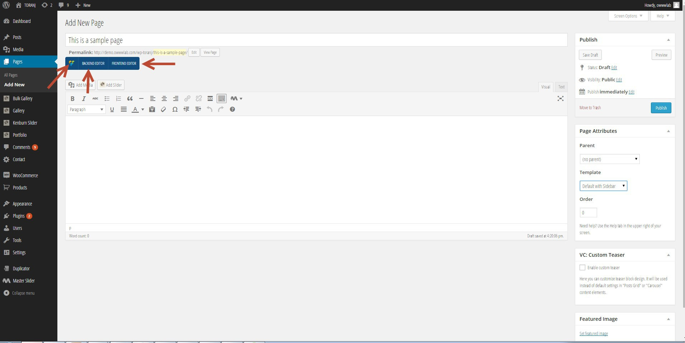
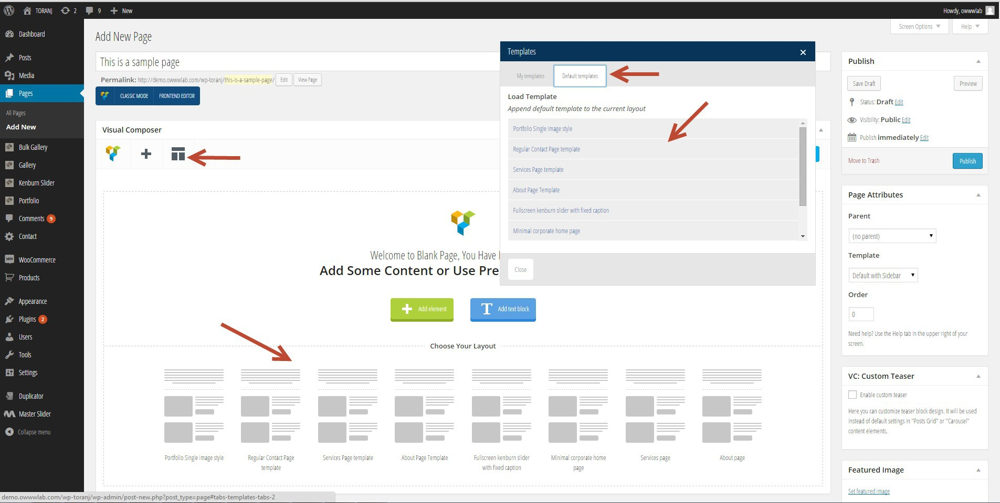
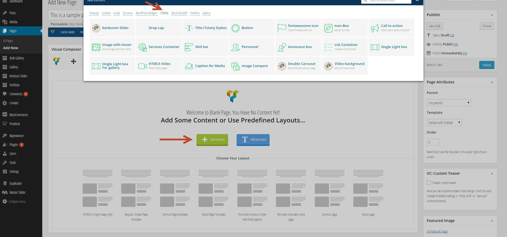

# Visual Composer &Toranj elements

Now that we are familiar with different available page templates, it's time to jump in and create pages using our page builder. We are using Visual Composer page builder in Toranj. Our focus on this section is on basic usage pf Visual Composer and elements and options that we have added to Visual Composer. For more information about Visual Composer, please refer to it's documentation which is available in _downloaded package->documentation->Visual Composer_

If you have installed and activate the Visual Composer you will see it's editor when you are creating/editing a page. It has two mode of editing and you can edit the content of page either from backend or frontpage. The benefit of frontpage mode is that you can also see the generated output in same page that you are making edits

Visual composer editing modes

Visual Composer has a responsive 12 column grid based on bootstrap. You can add rows and different column sizes and change the layout. Let's take a look in to available options. Here is what you will see after adding a row element:

Row element in Visual Composer and available editing tools

1. Move the row in page
2. Change the columns number
3. Add column to row
4. Edit row
5. Duplicate row
6. Delete row
7. Add element to column

### Visual Composer templates

The purpose of VC template is that you can create it once and use it in other pages. We have made some complicated pages of our demo as template so you can create a page like them with just one click.

Available templates for visual composer

### Toranj VC elements

Toranj general VC elements can be found in Toranj tab. Following screenshot shows the list of available items in current version

Toranj VC elements