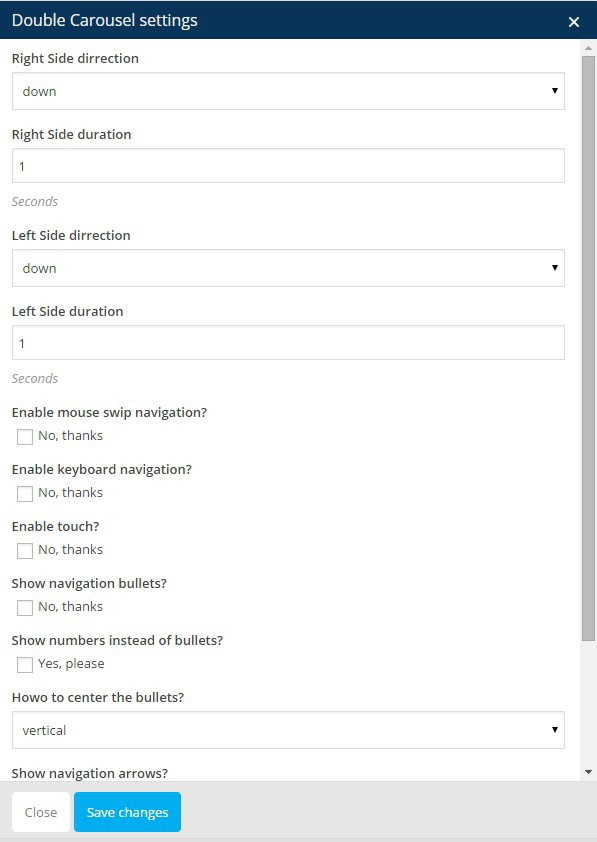
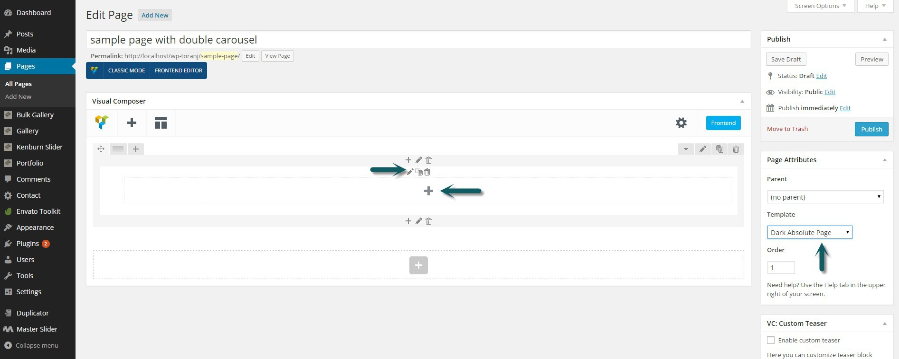
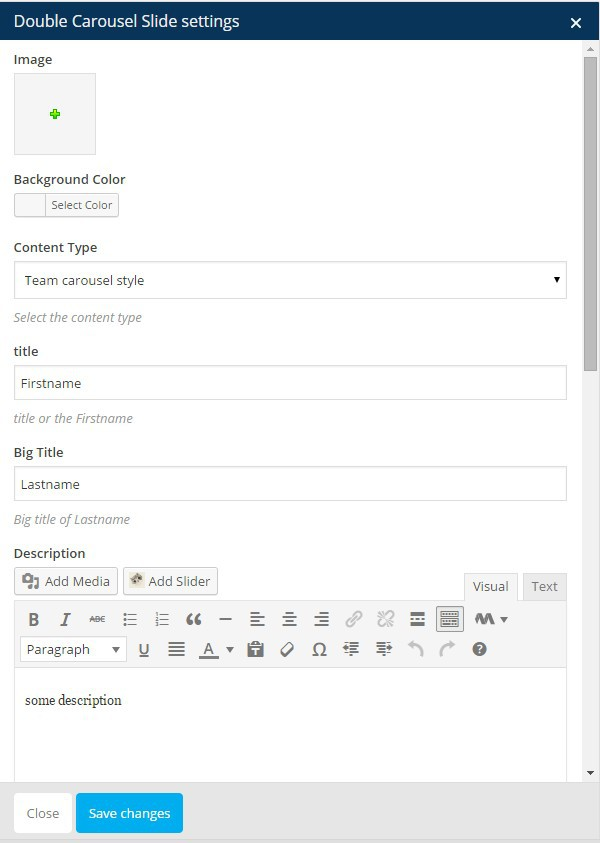

# Double Carousel

Double Carousel is an element in Visual Composer. Because of it's importance we are going to discuss it here in a separate section.

Double carousel element has been originally developed for team member page but it is also capable of having any other HTML markup as slide content as well. The double carousel element contains a wrapper element which is "Double Carousel" and after adding the wrapper element and set the settings, you can then add each slide as a new element. Let's take a look at the wrapper settings



 |Field|Description|
|--- |--- |
|Right Side direction|Can be down or up, double carousel has two right and left side. the right side is the slide image and left side is slide content. Each one can have different sliding direction.|
|Right Side duration|Duration of right side sliding animation in second|
|Left Side direction|Can be down or up, double carousel has two right and left side. the right side is the slide image and left side is slide content. Each one can have different sliding direction.|
|Left Side duration|Duration of left side sliding animation in second|
|Enable mouse swipe navigation?|Whether or not you want to have mouse scroll navigation|
|Enable keyboard navigation?|Whether or not you want to have keyboard navigation|
|Enable touch?|Whether or not you want to have touch swipe navigation|
|Show numbers instead of bullets?|Carousel pager can be either bullets or slide number|
|Carousel pager position|Carousel pager can be centred either horizontally or vertically|
|Show navigation arrows?|Pause the slider on mouse over|


Here is what we see after adding the wrapper element. **Notice** that the wrapper setting is still editable using the edit icon and also we have a plus icon in center of wrapper that can be used for adding slides.




After clicking on plus icon we will have the VC popup with only one available element which is "Double Carousel Slide". Go ahead and add a new slide



|Field|Description|
|--- |--- |
|Image|The image of slide that will be shown in right side.|
|Background Color|Background color of left side|
|Content Type|Select team carousel if you wan to use team page template or select "Let me do my own" If you want to add your markup|
|title|First line of slide title (used for first name)|
|Big Title|Second line of slide title (used for last name)|
|Description|Description or content of slide ( used for short biography about team member)|
|Add social icons?|Whether or not you want to show social icons in each slide|
|My own content|You can add the custom HTML markup of slide here.|


### Creating demo home page double carousel

In our [main demo](http://demo.owwwlab.com/wp-toranj) we have a double carousel in home page that is different from team member style. This is a custom style and markup and because we wanted to show tat you can do something beyond default layout as well we choosed to handle the whole HTML markup and page CSS is this speccifi page and not n theme main syle. It is highly recommended that you import our sample demo and use the page that we built if you exactly need the demo page but if you want to know how things works follow this secton. First step is using the "Let me do my own" option in content field and adding following markup to each slide

```
<h2 class="section-title double-title">  
<span>Professional</span>Photography  
</h2>  
<p>Your task is not to seek for love, but merely to seek and find all the barriers within yourself that you have built against it.</p>  
<a href="http://demo.owwwlab.com/wp-toranj/portfoliogroup/videography/" class="btn btn-transparent">Our Works</a>    
```

The next step is adding some custom CSS to the page. Check following article from our knowledge base for information on adding CSS to a specific page:

[](http://knb.owwwlab.com/owwwlab-support/how-to-add-custom-css-to-a-page-using-visual-composer/)

The style that we need to add is:
```
.my-carousel{
    
}
.my-carousel .vcarousel-counter,
.my-carousel .vcarousel-prev a,
.my-carousel .vcarousel-next a{
    color:#fff;    
}

.my-carousel{
    padding:0 10%;
    text-align:left;    
}
.my-carousel h2{
    font-size: 40px;
    margin-bottom: 20px;
}
.my-carousel h2 span{
    font-size:18px;
}
.my-carousel p{
    
}

.slide1 h2{
    font-size: 45px;
    color: #5E7D5F;
}
.slide1 h2 span{
   
}
.slide1 h2:after{
    background-color: #9A9A9A;
}
.slide1 p {
    color: #717173;
}
.slide1 btn{
    
}
.slide1 btn:hover{
    
}

.slide2 h2{
    font-size: 45px;
    color: #886656;
}
.slide2 h2 span{
   
}
.slide2 h2:after{
    background-color: #D5D2CE;
}
.slide2 p {
    color: #717173;
}
.slide2 .btn{
    color: #fff;
    background: #D6CAC3;
}
.slide2 .btn:hover{
    background: #A8A18E;
}
.slide3 h2{
    font-size: 60px;
    color: #aa303d;
}
.slide3 h2 span{
   
}
.slide3 h2:after{
    background-color: #f16070;
}
.slide3 p {
    color: #808080;
}
.slide3 .btn{
    color: #fff;
    background: #a72a38;
}
.slide3 .btn:hover{
    background: #cd4958;
}

@media (max-width: 480px) {
    .slide1 h2,
    .slide2 h2,
    .slide3 h2,
    .my-carousel h2 {
        font-size: 30px;
        margin-bottom: 20px;
        color:#fff;
    }
    .slide1 p,
    .slide2 p,
    .slide3 p,
    .my-carousel p{
        color:#fff;
    }

}
```

The last step is adding class `my-carousel` to wrapper row of double carousel. Click on edit icon in right hand side of row and enter ".my-carousel" in "Extra class name" field