# Bulk gallery Plugin

Bulk gallery is an alternative plugin for gallery. In this plugin each post is a gallery unlike the main gallery plugin that each post was an image. It is more conventional and has a drag and drop bulk image importer. You can also have private and password protected galleries in bulk gallery plugin.

### Add new gallery

If you have installed and activated the bulk gallery plugin, you should see the "Bulk gallery" menu in admin panel. Lets jump in to creating a new gallery. Here is what we see after clicking on "Add new".

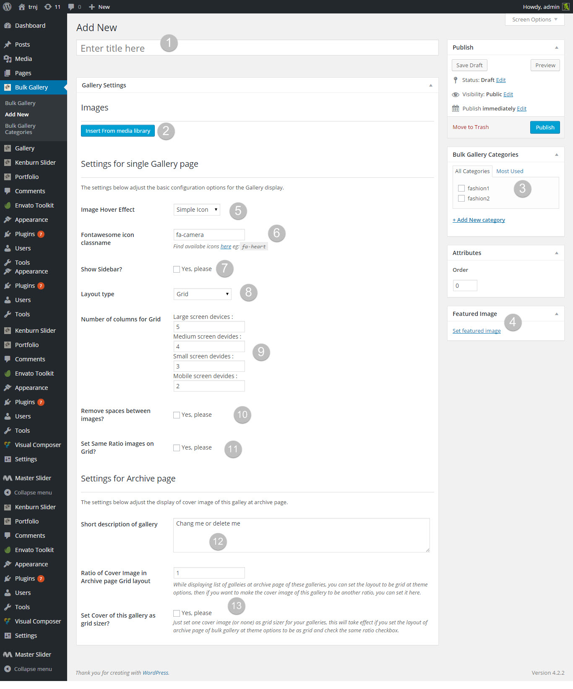

1.  Gallery title
2.  Import images from media library using the "import from media library" button
3.  Gallery category, we will discuss categories in next section
4.  Gallery cover image for archive and groups pages
5.  Gallery images hover effect
6.  Hover icon class in case you select the "Simple icon" for hover type
7.  Show/hide sidebar in gallery page
8.  Gallery layout, at the moment bulk galleries can have two grid and horizontal scroll layout
9.  Number of columns in grid layout
10. Remove padding between images in grid layout
11. Refer to "Image's ratio and grid-sizer in Grid layouts" section
12. Gallery description for archive and groups pages
13. Refer to "Image's ratio and grid-sizer in Grid layouts" section

I've added some images and fill the fields. Here is what I have now:

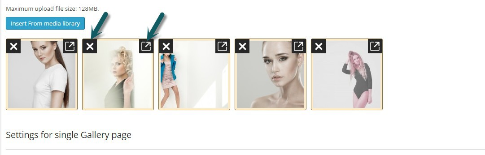

Notice that there is two icon on each image, delete and edit. You can also change the order of images by using drag and drop. Each image has some meta-data like title and alt text that can be edited by clicking on edit icon. In editing meta-data page you will see two field for "Grid sizer" and "image ratio" that you can find more about these in [What is same ratio and grid sizer](#) section

Now we are ready to publish our gallery. I've made two gallery one named "Fashion" and the other is "Macro". Here is my bulk gallery page in admin panel now:

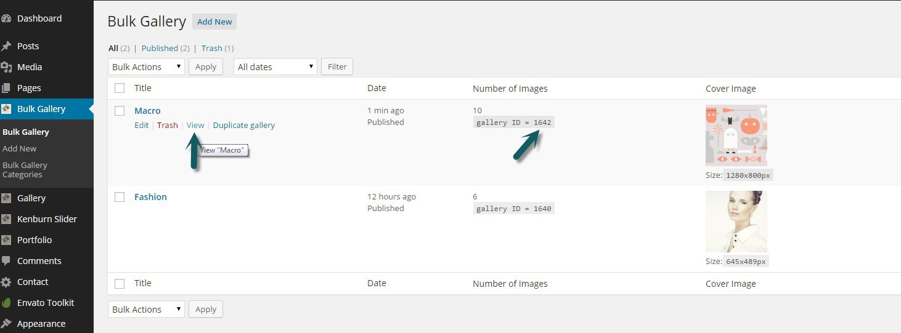

If you mouse over one of them you will see a "View" link that you can use for viewing gallery front-end. Also Gallery ID is available that you will need if you want to insert this gallery in to a page.

My Fashion gallery has "horizontal scroll" layout with sidebar and Macro gallery has grid layout without sidebar. Here is the front-end page of my galleries

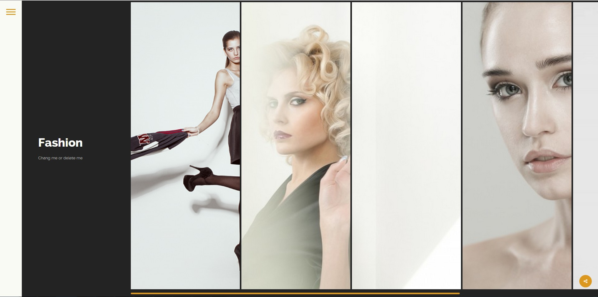

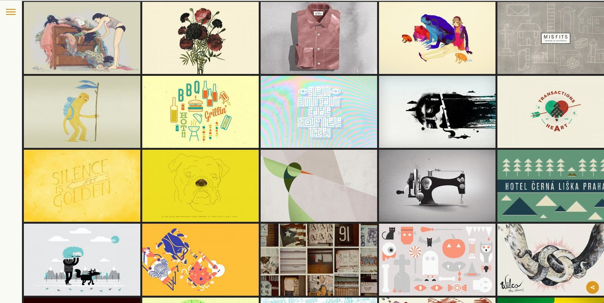

### Working with bulk gallery categories

Categories in bulk gallery are groups of galleries. Each category front-end page is list of all available galleries in that roup and also in archive page of bulk gallery you can filter all alleries based on their categories. We will discuss the archiv page in next section.

You can add, edit and manage the bulk gallery categories from the "Bulk gallery categories" menu in admin panel. Here is what we have after clicking on "add new"

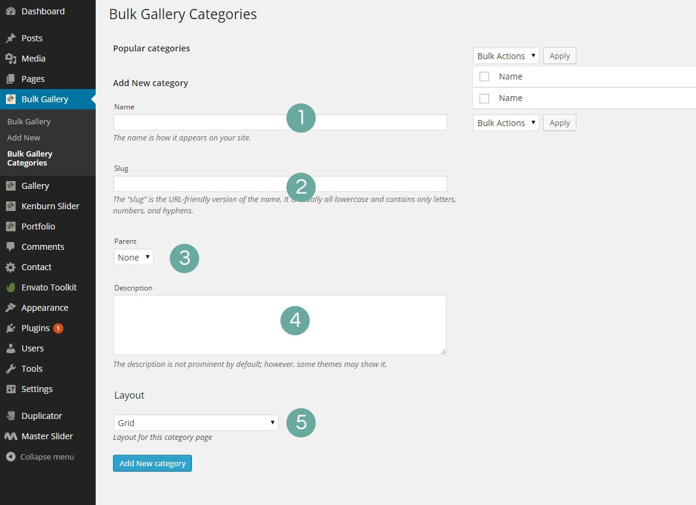

1. Category name
2. Category slug, will be generated from the name
3. Category parent in case you want this group to be a sub-category of another category
4. Category description that will be shown in layouts with sidebar
5. Category layout that in current version (V1.3) can be Grid or Horizontal scrolling

I've added a new category "photography" and assigned those "Fasion" and "Macro" galleries that we added in previous section to this category. Here is the screenshot of admin-panel, notice you can still use the view link to view category front-end page.

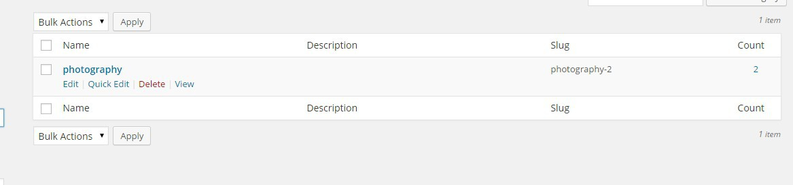

There are some options in theme option->bulk galery tab that you can use for customizing category pages. We will take a look at them in bulk gallery settings section.

### Bulk gallery archive page

Archive page of bulk gallery is the page that we list all available galleries. If you have groups as well then the galleries in archive page can be filtered based on those groups. Here we have created 4 gallery. Fashion, Macro, Models and People and two category "2013" and "2014". Here is what we see in the front page of our bulk gallery which if you did set the permalinks to "post-name" should be wordpress site/bulk-gallery

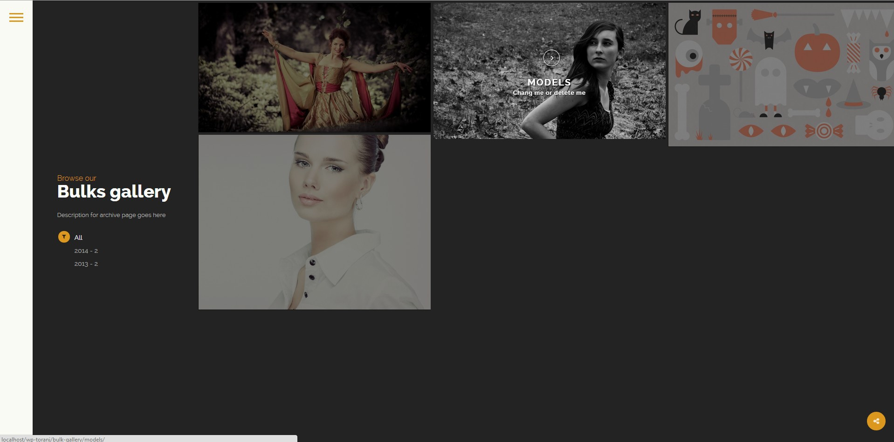

Settings for the layout and content of this page can be done in theme option->bulk gallery tab. Refer to "Image's ratio and grid-sizer in Grid layouts" section

### Bulk gallery settings

Options for bulk gallery can be found in _Admin panel-> appearance->theme-option->bulk gallery tab_. Here we are going to take a look at them

#### Bulk Gallery Archive Layout

Either Grid or horizontal scroll at the moment

#### Archive page title line 1

This is first part of gallery archive page title. The title will be shown if the archive page has side bar (eg:Browse our)

#### Archive page title line 2

This is second part of gallery archive page title. The title will be shown if the archive page has side bar (eg:Gallery)

#### Archive page side content

This can be a description or generally the sidebar content (below title) of gallery archive page

#### Category page upper title

The upper title of category pages, the main title would be the category name

#### Grid - Layout Type

With that dark sidebar or full with no sidebar.

#### Grid - Show filters?

Show/Hide grid filters

#### Grid - Filter title(default is "Filter")

If you choose grid layout without sidebar, then this the text for filter drop-down title.

#### Grid hover style

Hover effect in archive and category pages

#### Grid - Same Ratio Thumbs?

refer to "Image's ratio and grid-sizer in Grid layouts" section

#### Grid - Remove spaces between images?

Enable/Disable spacing between thumbnails in grid layout

#### Grid - Large Screen column count

Number of grid columns in large screens (width of container > 1200)

#### Grid - Medium Screen column count

Number of grid columns in medium screens (width of container > 800)

#### Grid - Small Screen column count

Number of grid columns in small screens (width of container > 500)

#### Grid - Extra small Screen column count

Number of grid columns in extra small screens (width of container > 300)

### Enable social sharing for bulk gallery

You can enable the social sharin for bulk gallery and have sharing icon in all bulk gallery related pages (archive, single and category). This an be done in _admin panel->appearance->theme option->Social sharing_. Just turn on the enable social sharing field and add your social websites.

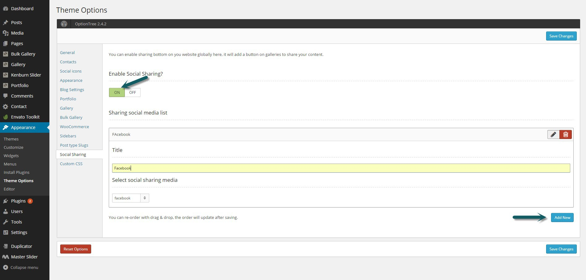

### Adding bulk galleries and groups to menu

If you were following this section, we used the view link in back-end to see the front-end of our galleries and categories. Here we are going to see how we can add a link to galleries and categories in menu. If you go to _Admin panel ->appearance->menus You should see the "Bulk Gallery" and "Bulk Gallery Categories" in left side that you can use for adding links to galleries and categories. **Notice:** If you don't see them in left side then click on "Screen options" (check the following fiure) and make sure that "Bulk Gallery" and "Bulk gallery categories" are checked and active in screen options._

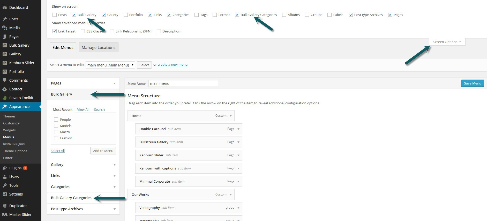

### Password protected and private galleries

One of the advantages of Bulk gallery over the Normal Gallery plugin is that you can have password protected galleries here. All you need is changing the visibility of gallery to "Password protected" or "private" when you are add/edit your gallery. Here is a screenshot of our Model gallery, As you see these options are available in publish box

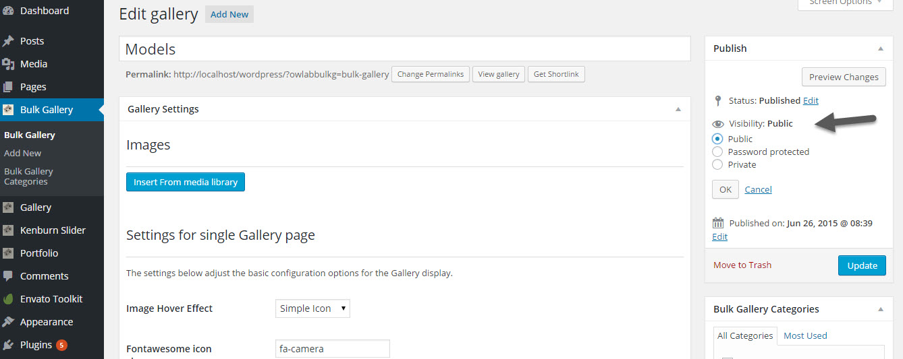

I've made the Models gallery password protected and here is a screenshot of the front-end page.

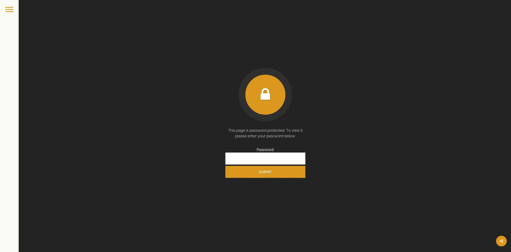

**Notice:**If you set a gallery to private, it won't be available in front-end but you can still use it in other pages for example using the bulk gallery elements in Visual Composer. Refer to next section for Bulk Gallery VC elements.

### Visual Composer elements for Bulk Gallery

In current version 1.3, there are two available element for Bulk Gallery. "Bulk Gallery Slider" and "Bulk Gallery Grid". The elements are available in "Bulk Gallery" tab of Visual Composer.

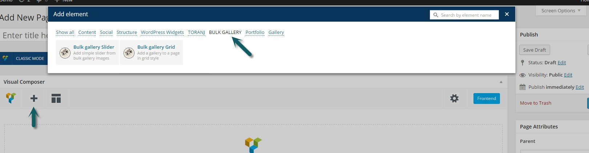

#### Bulk gallery Slider

As it can be predicted from the name, using this element you can create a simple slider from images that are in one of your galleries. Here we are going to explain the available fields and see an example of the result in front-end

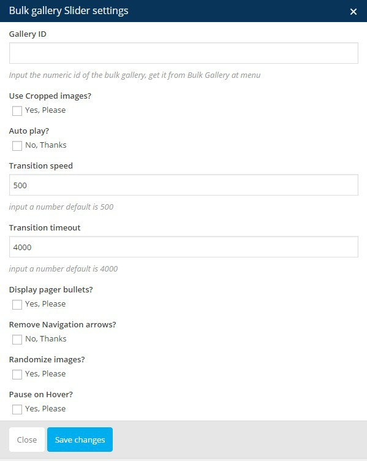

  
|Field|Description|
|--- |--- |
|Gallery ID|The unique ID of the gallery. You can find this ID for each gallery in Admin panel->Bulk Gallery menu|
|Use Cropped images?|If you select this the images will be croped and the height of slider will be same as the first image height. It is best for images that have almost same ratio so you don't have to make them exactly in same size. If you don't select this height of slider will be variable based on current slide image dimension|
|Auto play?|Whether or not the slide should be autoplay|
|Transition speed|Integer: Speed of the transition, in milliseconds|
|Display pager bullets?|Whether or not you want to display the slider pager bullets|
|Remove Navigation arrows?|Whether or not you want to display the slider navigation arrows|
|Randomize images?|Randomize the order of the slides|
|Pause on Hover?|Pause the slider on mouse over|

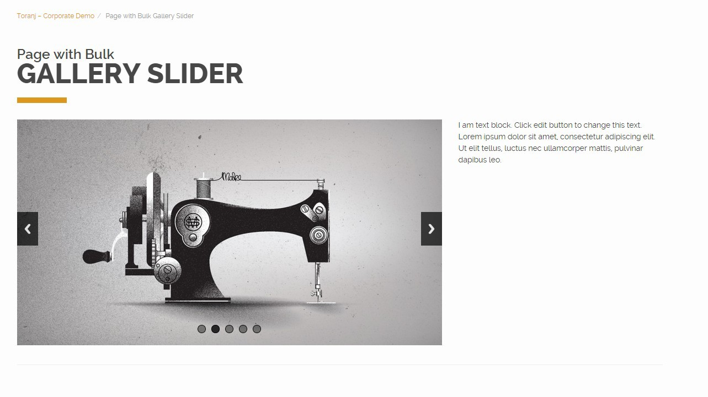

#### Bulk Gallery Grid

Same as slider, using this element we can generate a grid layout from images that are in a bulk gallery

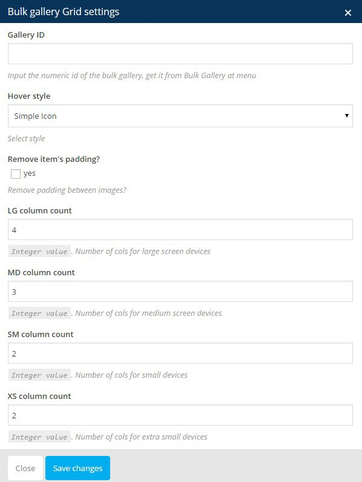

|Field|Description|
|--- |--- |
|Gallery ID|The unique ID of the gallery. You can find this ID for each gallery in Admin panel->Bulk Gallery menu|
|Hover style|Select the hover effect of images|
|Remove item's padding?|By default there is a space between grid images, you can remove it using this option|
|LG column count|Number of grid columns in large screens (width of container > 1200)|
|MD column count|Number of grid columns in medium screens (width of container > 800)|
|SM column count|Number of grid columns in small screens (width of container > 500)|
|XS column count|Number of grid columns in mobile screens (width of container > 300)|

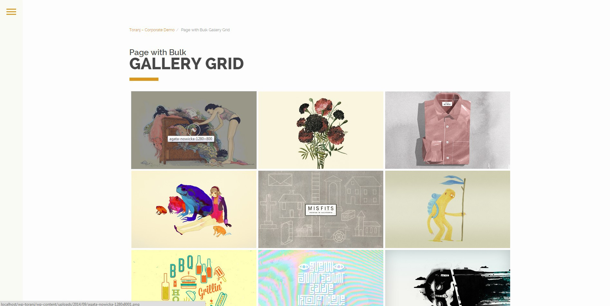
