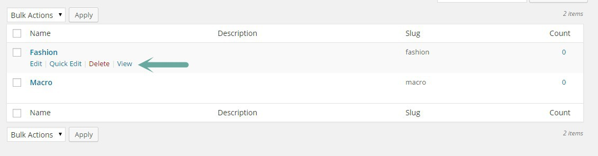

# Gallery plugin

In gallery plugin each image is a post in WordPress and the image itself should be uploaded or inserted from media library using featured image box. We are going to cover all details and question that you might have about gallery plugin in this section.

### Adding new photo to gallery plugin

If you have installed and activated the gallery plugin, you should see a gallery menu in sidebar of WordPress admin panel. Go ahead and hit the add new

Add photo to gallery plugin-step 1

After that we will see following window.

Add photo to gallery plugin-step 2

1. This is the image title it will be shown in lightbox and also image single page
2. You can select which album this image belongs. We will discuss about albums in next section
3. Here you can upload the image file or just select it from media library
4. Short description
5. This is the content of image page
6. Refer "Image's ratio and grid-sizer in Grid layouts" section
7. Refer " Image's ratio and grid-sizer in Grid layouts" section

Ok so go ahead and give it a title and set the featured image for now and publish it same as you do for posts and pages. I just repeated the whole procedure couple times and here is what I have in gallery plugin now:

### Gallery archive page

As you already know in this gallery plugin each post is an image so the gallery archive page is list of available images. we have added some images to gallery plugin in previous section now we can view them in gallery archive page. If you have set the permalinks to post-name (refer to permalinks section) then the url of gallery archive page would be: wordpress website/gallery (eg : [http://demo.owwwlab.com/wp-toranj/gallery](http://demo.owwwlab.com/wp-toranj/gallery)). Here is a screenshot of our gallery archive page:

Gallery archive page

Gallery archive page has various customization options in _theme option->gallery tab_ like different layouts, hide/show sidebar, hide/show filters and etc. We will discuss this in gallery settings section

### Albums in gallery plugin

Album is our taxonomy in this gallery plugin and it is a group of images. You can create an album in _gallery menu->albums_

Adding an album to gallery plugin

1. Album title (eg:Fashion)
2. Album slug. It will be auto generated from the title (eg:fashion)
3. Album parent. In case you need sub-albums you can select a previously created album as the parent here.
4. Album Description. This will be shown in layouts with sidebar under album title
5. This is the thumbnail of album and will be used in list of album pages
6. Album front-end layout. Each album has a front-end like gallery archive. here you can select between grid and horizontall scroll layout.
7. Refer to "Image's ratio and grid-sizer in Grid layouts" section

I've created two album "Fashion" and "macro" . Fashion gallery has "horizontal scrolling" layout and Macro has grid layout. Now we can start assigning our gallery images to these albums. Following screenshot is the editing page of one of gallery images

Set the album for gallery images

I randomly assigned some images to each album, no we are going to see each album page in front-end. Following screenshot is my albums. **Notice:** If you move your mouse near album title, you will see a "View" link below the name that can be used for viewing album page.

Albums list and view link

Here is a the front-end page of our created albums:

Album front-end page has various customization options in _theme option->gallery tab_ which we will discuss this in gallery settings section

### Working with gallery sub albums

Albums can have sub albums as well and this hierarchy can go in unlimited levels. This would give you the ability to organize your gallery in one hand and create special pages like filterable grid gallery in other hand.

OK back to our created albums in previous section. We had two Macro and Fashion album, now I am going to create a new album (let's call it Photography) and set it as the parent of Macro and Fashion. Just add in same way we did those albums. The screenshot is my albums page:

Editing an existing album-step 1

Now we are going to set the parent album:

Editing an existing album-step 2

And do the same for Macro album as well and now if we see the album section again we should have a "-" mark before Macro and Fashion that represent being sub album of photography.

Editing an existing album-step 2

We are all good to got and check the front-end page of photography albu. We will have a filterable grid by default like following screenshot

Front-end page of an album with sub-albums

1. Album name
2. Grid filters
3. sub-album name and count of images in each

### Gallery Settings

Ok now we are familiar with gallery plugin, adding photos, albums and working with sub-albums. Let's take a look in to available options for them.

**gallery settings:**_Admin panel->apperance->theme options->gallery tab_

Here is the list of all available settings:

#### Archive layout

This is the layout for gallery [archive page](#gallery-archive). As you see there are four available different layout. Here is the screenshot of each one of them.

Grid layout

Horizontal scrolling layout

In-page layout

Minimal layout

#### Archive page title line 1

This is first part of gallery archive page title. The title will be shown if the archive page has side bar (eg:Browse our)

#### Archive page title line 2

This is second part of gallery archive page title. The title will be shown if the archive page has side bar (eg:Gallery)

#### Archive page side content

This can be a description or generally the sidebar content (below title) of gallery archive page

#### Archive Page Same Ratio Thumbs on Grid?

refer "Image's ratio and grid-sizer in Grid layouts" section

#### Image Hover type

Hover effect in archive and album pages

#### Grid - Layout Type

With that dark sidebar or full with no sidebar.

#### Grid - Show filters?

Show/Hide grid filters

#### Grid - Filter title(default is "Filter")

If you choose grid layout without sidebar, then this the text for filter drop-down title.

#### Grid - Remove spaces between images?

Enable/Disable spacing between thumbnails in grid layout

#### Grid - Large Screen column count

Number of grid columns in large screens (width of container > 1200)

#### Grid - Medium Screen column count

Number of grid columns in medium screens (width of container > 800)

#### Grid - Small Screen column count

Number of grid columns in small screens (width of container > 500)