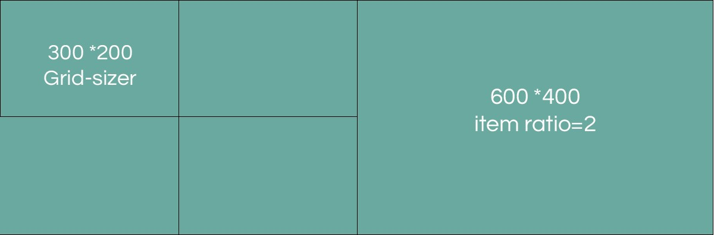

# Image's ratio and grid-sizer in Grid layouts

Pretty much everywhere that we have a grid layout, you will see these options and fields. This is an original concept in Toranj theme in order to give you ability of creating complex grid layouts. Here we will explain the meaning of these terms and using them.

### Toranj grid layouts logic

The logic of Toranj grid layout is based on number of columns, you probably have seen those Number of column in large or medium screen size option in theme opton and grid layouts elements. basically every grid can have 4 different number of columns based on screen size, precisely based on container width. This way you can have for example 5 column in large devices, 3 column in iPad and 1 or 2 column in iPhone.

Suppose that we have a grid with 4 column, and in each column one image thumbnail. Then the height of multiple of grid sizer height. This will give you the perfectly aligned grid even when your images are not in same size.

### What is same ratio items and grid sizer

So the height of each item is based on the image ratio but what if we do have item's with similar ratio but not exactly same? For example one of my images is 1280\*800 and the other is 1190\*768. If you put these two in the grid it will create a little mis alignment that is not so eye pleasing so using the same ratio option you can correct the issue of each item based on a refrence item which is the grid sizer. That's it we will round the height of each item to the near

### What is thumbnail width ratio

Up to this point all items had same width based on number of columns but what if we need a eatured item that is larger than others? Here you can use thumbnail width ratio. It can be a number like 1 or 2 and the meaning is that set the width of this item X\* width of grid sizer. You can create following layout using this option

Complex grid with different item's size