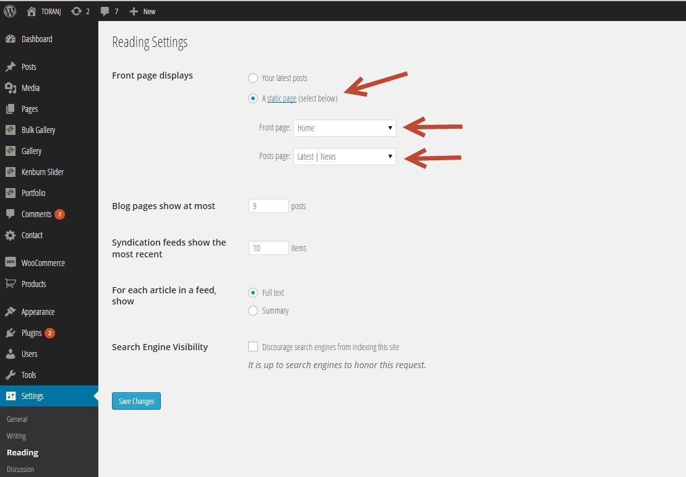

Import sample data
------------------

The best way to get familiar with theme is to import our sample data and create a copy of our demo in your server. That way you can check and see how things works or even use it as an initial platform to build your website.

Each demo sample file is an xml file and you can find them in download package->sample data. Full demo XMl file is **toranj-sample-data-all\_\_with\_images.xml** and is located in _download package->sample data->Full Demo_ folder.

Go to _Admin panel->tools->import_ and select WordPress from the list. If this is your first time using this tool, you will be redirected to a page for install and activating WordPress importer. You need to select the xml file and click on "upload file & import". in Next step we should set admin user also there is an option for importing media attachment of demo as well.

Import XML sample data

### Important FAQ

**why I get those “Could not import…” ?**

In our full demo xml file (toranj-sample-data-all\_\_with\_images.xml) we have included WooCommerce sample data inside it. In case you haven’t installed WooCommerce plugin, the importer won’t import those data and will notify you that could not import those pages or files. It is not an error and it is normal.

**Import sample data failed**

Importing XML file is related to many parameters like (guest and host server configuration, time out, media file sizes, etc.). You should **repeat the procedure** couple times and you will get the media files eventually. In Worth case scenario if you couldn't import the media files do not select the **"Download and import file attachments"** so you can get the content without images.

### Required settings for sample demo

After importing demo content, you need to set some basic settings.

#### Home page and blog page

Go to Admin panel->settings->reading and follow the screenshot:

Reading settings

#### Permalinks

Permalinks are the permanent URLs to your individual weblog posts, as well as categories and other lists of weblog postings. If you are not familiar with it please check [Using Permalinks](http://codex.wordpress.org/Using_Permalinks) article. In order to set permalink go to _admin panel ->settings->permalinks_ and set the permalinks to "Post name".

#### Menu location setting

We must assign the menu to a location. Go to admin panel->appearance->menus and scroll down the page and find "Menu Settings" section and select "Main menu" as menu location then save the menu.

Setting menu location