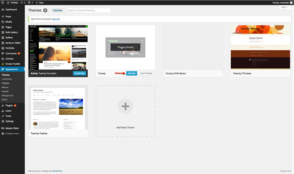

# Installing theme and plugins

In this section we are going to cover installing theme and plugins using different possible ways including WordPress admin panel and FTP.

First things first, to install Toranj theme you need a WordPress website up and running either on your local machine or your online host. If you need help for that please check [Installing WordPress](#) article

Extract the zipped package downloaded from ThemeForest to your desktop and find **toranj-theme\*.zip** file which is located in “toranj theme” folder. You can install theme using admin panel or FTP.

### Installing theme using WordPress admin panel

Please go to _WordPress admin panel -> appearance -> themes_ and then _Add new ->upload theme_ and upload the theme zip file. After installation, you must activate the theme as well.

### Installing theme using FTP

For any reason if you failed to upload theme with WordPress admin panel, you can also do it using FTP. Unzip the theme zip file and upload “toranj” folder to _WordPress root -> wp-content->themes_ then go to _admin panel -> appearance -> themes_ and activate Toranj theme.

Activating theme