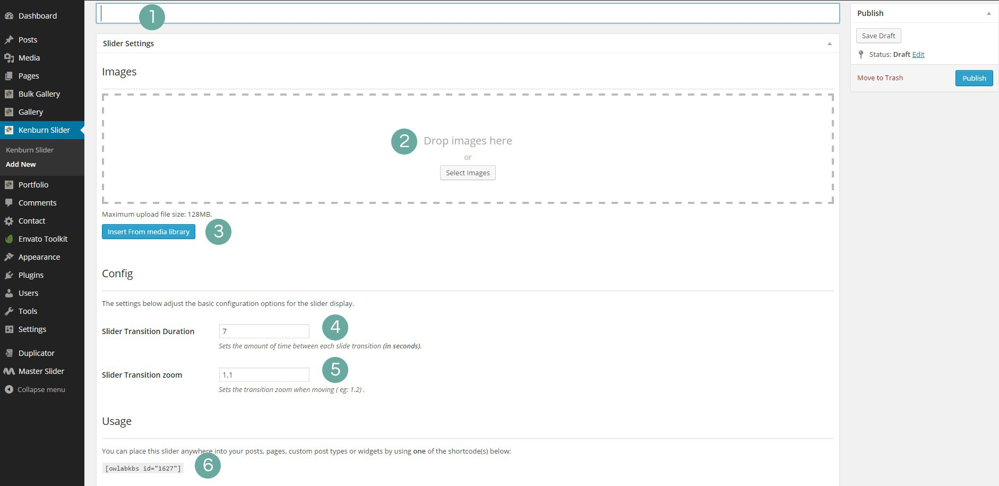
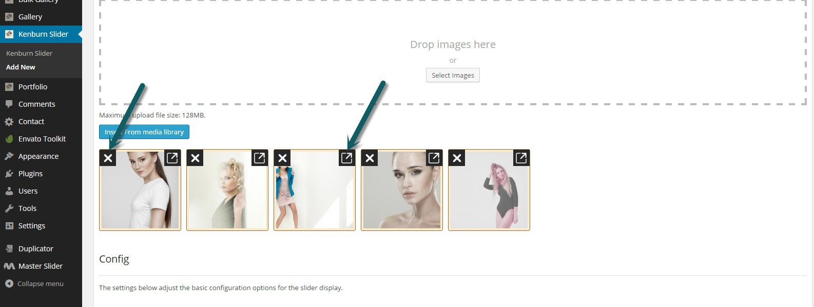
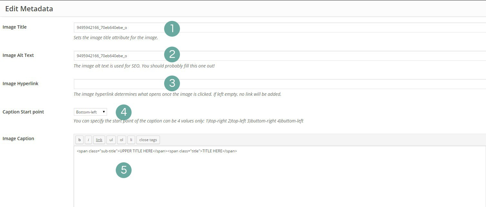
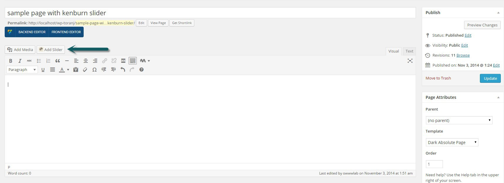
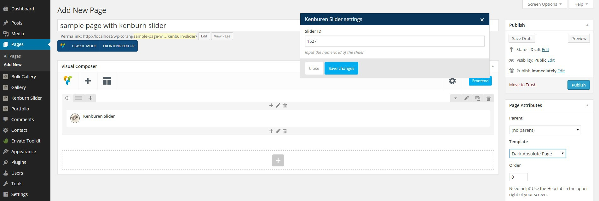
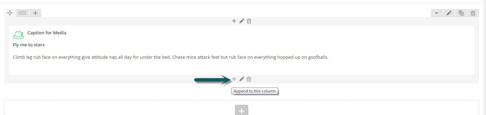
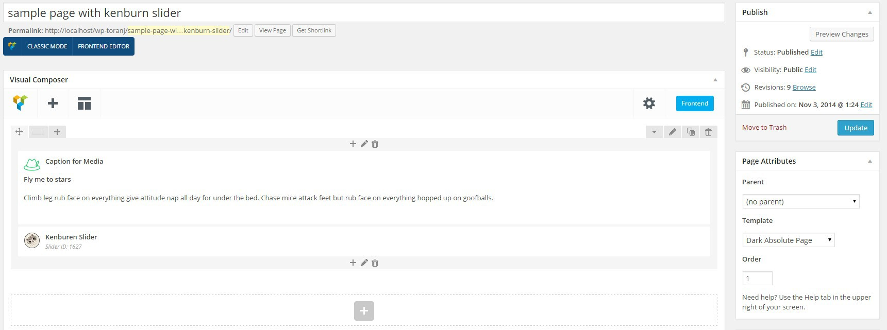

#Kenburn slider

Kenburn slider is another native plugins of Toranj theme. Here we are going to cover creating, using and customizing your kenburn sideshow.

### Add new kenburn slider

If you have installed and activated the kenburn slider plugin, you should see the "Kenburn slider" in WordPress dashboard menu. The only available option is "add new" and here is what we deal with in adding new kenburn slider:

1. Title of slider
2. Uploading images directly
3. Insert images from media library
2. Transition duration
1. Transition zoom
2. The ID of slider, you will need this ID wherever you want to use this slider

Ok first step is adding images, I've just added some and here is what we have now:

Notice that there are two icon on each image, edit and delete. Also you can change the order of them using drag and drop. Each slide has some meta-data like **Captions** that must be edited.

Following figure is a screenshot of**Kenburn slides meta-data** editing page

1. Image title
2. Image alt text for SEO
3. Image hyper-link, if you need the slide click-able add your link here
4. Caption start point
5. Caption content. You can insert any HTML markup here but the default one is:
    
    UPPER TITLE HERETITLE HERE
    
    Which you can enter the caption to line text, If you don't need any caption on your slides the delete the caption content and leave it blank.
    

### Adding Kenburn slider to pages

Ok now that we have created our kenburn slideshow, we need to insert it in a page. There are two ways to do that with or withouth Visual Composer.

When you are creating a page using the WordPress editor you should see the "Add slide" button right above the editor area. using this button, you can simply select your slider from available kenburn sliders and insert it in to page.**Notice that** the page template must be set to **Dark Absolute Page**

Another way of adding kenburn slider to page is using the kenburn slider element in Visual composer. All you need to do is adding the element and give it the ID of kenburn slider that you just built.

**Notice** that you must set the page template to "Dark Absolute page" to have fullscreen slider

That's it just go ahead and publish & view the page.

### Kenburn slider with fixed caption

There is a [kenburn slider with fixed caption page](http://demo.owwwlab.com/wp-toranj/kenburn-slider/) in our demo. Here we are going to build that page. We already have created a kenburn slider but we don't need caption on each slides so just go to each slide's meta and delete the caption content.

What we need to do is adding two element to the page. "Caption for media" and "Kenburn slider" but **You must add theme both in one row**. You can prepend or append elements to a row and columns using the plus icons in above and below parts of row. Additionally we need to add "Caption for media" element **before** the "kenburn slider" element In that row

Let's start with adding caption for media element. The type that we are working here is "Big title with Desc" insert the title and description. If you need the title in two part, you can add a`  
tag` between words. Another important setting is **Media type** which must be set to none since we don't want any media from the caption element.

Now use the plus icon ( Check the screenshot) and add another element which is our kenburn slider element.

Here is the screenshot of final result. Notice that the page template should be "Dark absolute page"

