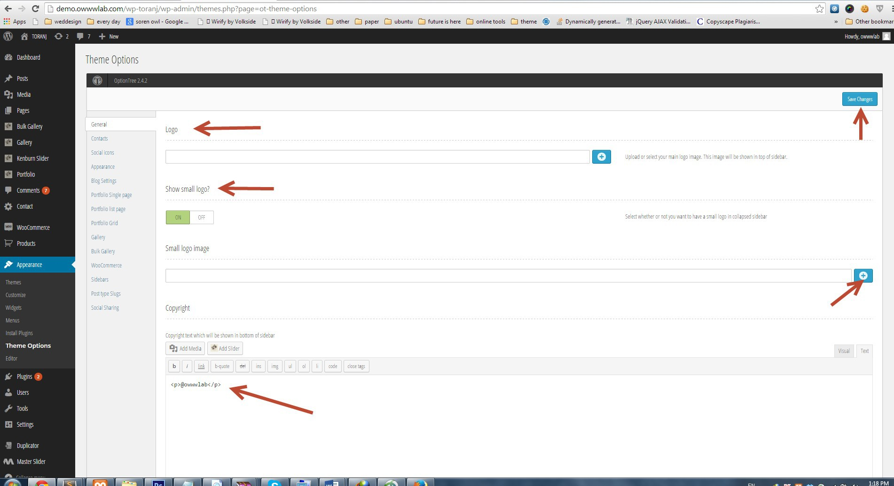

# Theme option & basic configurations

The purpose of this section is to help you get familiar with some basic settings like add logo, social icons, add menu, etc.

Pretty much every configurable option in Toranj theme is located in **theme options**. For example logo, social sharing, blog layout, coloring options and etc. The theme options that we will use here is available in _Admin panel->appearance->theme options_ Specific tabs like gallery, portfolio and etc will be discussed in related sections

Basic settings of site in theme options

### Adding logo

> _Admin panel->apperance->theme option->General tab_

We have two logo option. The main logo will be shown in sidebar and the mini logo in closed menu bar.

### Set copyright text

> _Admin panel->apperance->theme option->General tab_

### Social icons

> _Admin panel->appearance->theme option->Social icons_

Each social icon needs a url and type. You can also re-order them with drag and drop.

### Contact page settings

> _Admin panel->appearance->theme option->contact tab_

The setting in contact tab will be used in page that has "Contact" page template. Contact detail is for adding contact details like phone or email. Each one can have a title, content and icon.

Contact description is the text that will be shown in contact page sidebar after contact details

Google map address will be shown in right side of the contact page, you need to enter your address here.

### Adding menu

> _Admin panel->apperance->menus_

The location of our menu is in sidebar and the location name is "Main Menu". You must set the location after adding your menus. In current version 1.3.0, **menu only accept one level of sub-menu.**

### Set home page

> _Admin panel->settings->reading_

You must set a frontpage for your website, otherwise the home page will be index of blog. Just set thee " Front page displays" to "static" and select one of available pages.