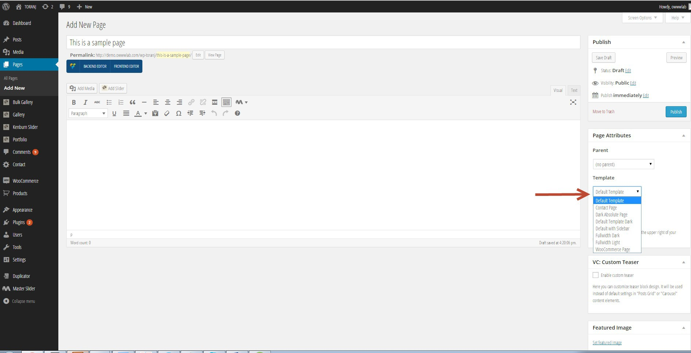
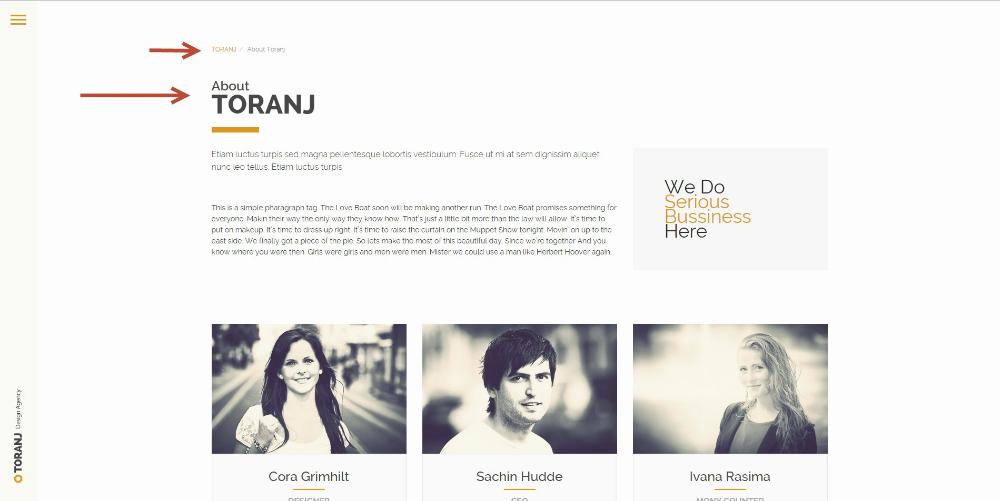
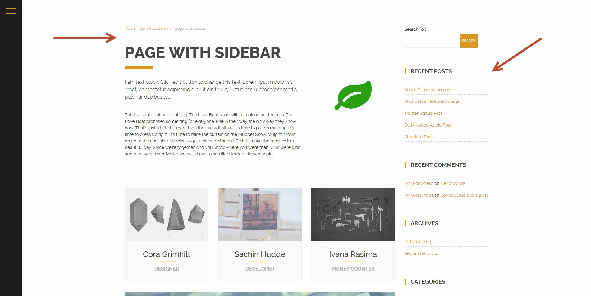
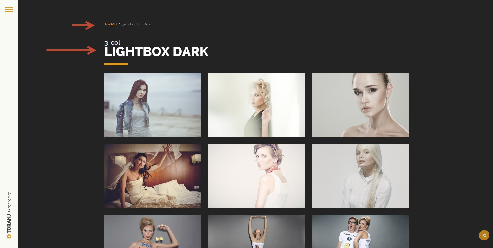
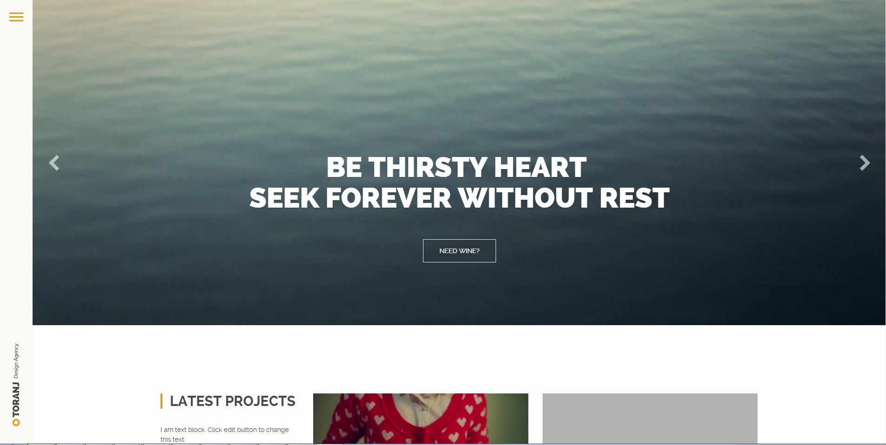
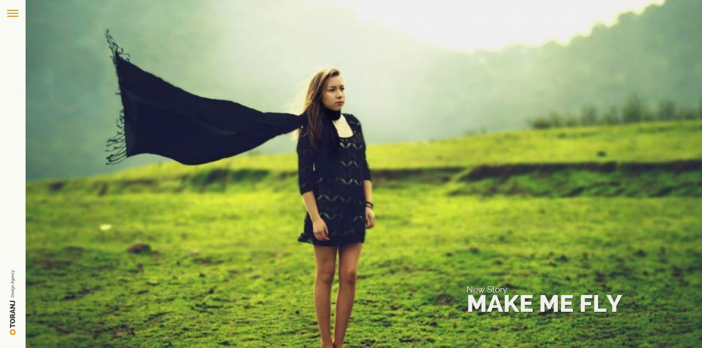
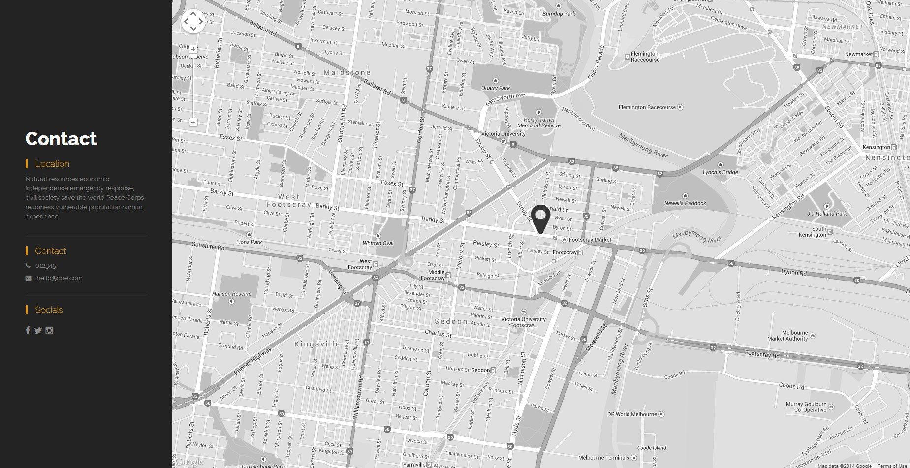
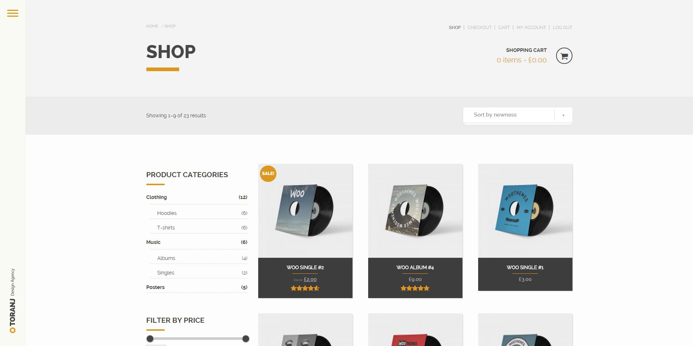

# Page templates

Page template is responsible for generated layout of page. We have 8 template in Toranj. In this section we are going to explain them and their purpose. Additionally we will have one example of output layout of page for each template.

Various page templates

### Default template
    
This is the default template for your pages. The whole page content will be wrapped inside a container and also this type will show title of page and breadcrumb. If you want the title of page in two line, you must enter a "|" between words. For example "About | Toranj".

Default page template which has container, title and breadcrumb of page.
    
### Default with sidebar
    
This is same as default template but with a sidebar in right side of page. You can put widgets in this sidebar from _admin panel->apperance->widgets->Main Widget Area_

Default page with sidebar in right.
    
### Default template dark
    
This one is same as default template but the background is dark. The background color can be set in _admin panel->apperance->theme option->apperance tab._

Default page template with a dark background.
    
### Fullwidth Light
    
We learned about the default teplate. The fullwidth templates have no container no title and basicly nothing. It gives you full controll over the page layout and you can create anything you need with Visual Composer. We will catch that in Visual Composer section but for reference the full width light has no container and the background is light.

Full-width page template
    
### Fullwidth Dark
    
Same as full width light but with a dark background. Again no container no nothing.
    
### Dark absolute page
    
This one is little bit different. Although it is basically same as full width dark template but there is a difference in height of the page. In absolute page height of the page is same as height of the browser and the page won't have any scroll. An example of it's application is in Kenburn slider page where we do need to have full-height of page and nothing more. Here we have no container and page title again.

Dark absolute page will have the height of window and the page won't scroll
    
### Contact page
    
We have finished the general layouts. This contact page layout is only and onl for generating contat page. It will give you a page with a dark sidebar at left for contact details and also a google map in right. The contact details and map address can be set in _admin panel->apperance->theme option->contacts tab_

contact page template
    
### WooCommerce page

This one is another specific page template and is only for index page of your shop in WooCommerce plugin.

WooCommerce page template