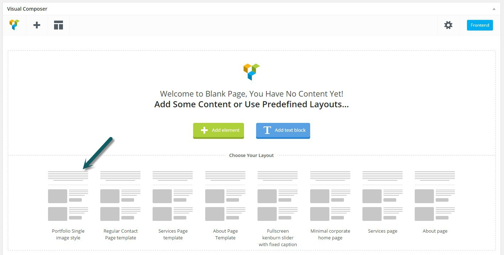
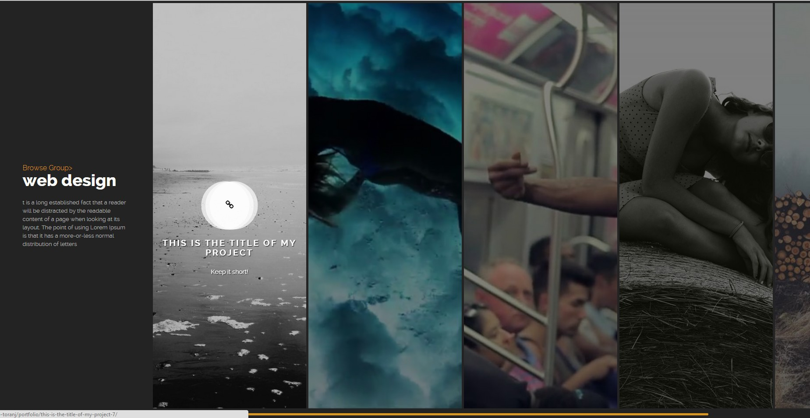
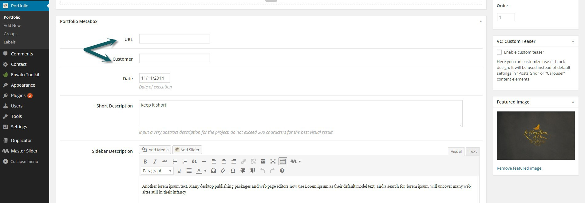

# Portfolio Plugin

Using this plugin you can manage your works and projects. Portfolio had different layouts or both single page and listing page. In this section we are going to cover all available variations and features, we will additionally create some example projects step by step.

### Adding new portfolio item

If you have installed and activated the portfolio plugin, you should see portfolio menu in admin panel. In this plugin each post is suppose to be a project so basiclly it is same as main gallery plugin. There is a "Add New" link in portfolio plugin and also as a sub-menu of portfolio menu. Here is what we see after clicking on "Add New".

1. Portfolio item title
2. Visual Composer editors for portfolio page content. **Notice** If you don't see Visual Composer in portfolio go to _dashboard-> Visual Composer menu->Role Manager_em> and put the "post types" option to "custom" for administrator (or any other user group you need) after that you should see _owlabpfl_ in options just check it along with page and post and save changes.
3. WordPress editor for for portfolio page content
4. Portfolios can be grouped together, here you can select/add a group that this project belongs to. We will discuss portfolio groups in next sections
5. Cover image of this portfolio, will be used in both portfolio list pages like archive page and groups page and in this project single page(in Right Sidebar and Left Sidebar layouts)
6. Date meta-field, will be shown in single page sidebar
7. Short description, will be shown in hover effect of the project thumbnail in listing pages(like archive page)
8. Sidebar description, content of sidebar in this project page in all layout except fullwidth
9. Whether or not you want to use a video cover instead of image
10. Video cover MP4 file. Can be uploaded directly or select from media library
11. Video cover WEBM file. Can be uploaded directly or select from media library
12. Video cover OGV file. Can be uploaded directly or select from media library
13. Layout of project front-end page. Check next section for details of each layout
14. Refer to "Image's ratio and grid-sizer in Grid layouts" section

That was the basic and short description of available fields, in following section we will go through important parts ne by one.

### Portfolio page content

Each portfolio content must be build using Visual Composer. If you are not familiar with Visual Composer, refer to Visual Composer section. Basically there is no restriction for the content, you can use all available element in Visual Composer but we have made our demo main portfolio layout as template so you can just create same one with one click.

Click on "BACKEND EDITOR" , you will notice that the WordPress editor is gone and instead the Visual Composer editor is available at the end of page. **Notice** that you can bring it up using drag and drop, If you move your mouse near the title of "Visual Composer".

Following figure shows the portfolio single item VC template. Just lick on it and the page will be filled with some VC elements.

And here is what we have next

As you see it's just some "Single Image" VC elements. You should edit each one and add your own images. I've made one portfolio with this layout and filled the images and some basic field like title and description and featured image. Following figure is from portfolio plugin in admin panel

If you mouse over the title, you will see the view link that you can use for viewing the front-end of our created project.

You can create whatever you need using Visual Composer, like adding Video, slider and etc. The rest of content is same as creating a page with Visual Composer

### Portfolio single layouts

In current version 1.3, there are 6 different porfolio single layouts available. The difference is in generated layout in front-end. We are going to take a look at each one.

#### Right sidebar parallax title

It has a main area and dark sidebar at right. Sidebar includes:

*   Project title
*   Project meta-data (eg:date)
*   Project Sidebar description

Main content area includes:

*   Cover image or video
*   Parralax title
*   Project description
*   Content that has been built with Visual Composer, this content comes after the cover image or video

#### Left sidebar parallax title

Same as previous one in content, except the sidebar is in left and the design is little bit different. It is more suited for projects with short title and data

#### Regular light

This one has a layout similar to default page template and it has no cover image or cover video at all. The main content should be build with visual composer.

#### Regular dark

Same as previous one except the background of page which is dark

#### Full light & dark

These templates are blank fullwidth in case you want to do something special and beyond our basic portfolios. Check the [demo 5](http://demo.owwwlab.com/wp-toranj-demo5/portfolio/) for examples.

### Portfolio Archive page

As you already know in portfolio plugin each post is an project so the portfolio archive page is list of available projects. I've added some sample projects to my portfolio and now we are going to see our archive page. If you have set the permalinks to post-name (refer to permalinks section) then the url of portfolio archive page would be: wordpress website/portfolio (eg : [http://demo.owwwlab.com/wp-toranj/portfolio](http://demo.owwwlab.com/wp-toranj/portfolio)). Here is a screenshot of our portfolio archive page:

Portfolio archive page has various customization options in _theme option->portfolio tab_ like different layouts, hide/show sidebar, hide/show filters and etc. We will discuss this in portfolio settings section

### Groups in portfolio plugin

Porfolio items can be grouped together using our taxonomy "Group". Groups have fron-end page like single items and the front-end page will be list of all available projects in that category with one of our 3 available layouts. You can create a group in _portfolio menu->Groups_

Lets create a group together, go to _portfolio menu->Groups_ and here is what we are dealing with:

1. Group title (eg:Web Design)
2. Group slug. It will be auto generated from the title (eg:web-design)
3. Group parent. In case you need sub-Groups you can select a previously created group as the parent here.
4. Group Description. This will be shown in layouts with sidebar under Group title
5. This is the thumbnail of Group and will be used in list of Group pages
6. Group front-end layout. Each Group has a front-end like portfolio archive. here you can select between grid, horizontal scroll and vertical scroll layout.
7. Refer to "Image's ratio and grid-sizer in Grid layouts" section

I've created three Group "web design", "poster" and typography . web design has "vertical scrolling" layout. Poster has grid layout and typography has horizontal scroll layouts. Now we can start assigning our portfolio projects to these groups. Following screenshot is the editing page of one of portfolio projects

I randomly assigned some projects to each group, no we are going to see each group page in front-end. Following screenshot is my groups. **Notice:** If you move your mouse near album title, you will see a "View" link below the name that can be used for viewing group page.

Here is a the front-end page of our created groups:

Horizontal scroll layout for group page

Vertical scroll layout for group page

Grid layout for group page

Group front-end page has various customization options in _theme option->portfolio tab_ which we will discuss this in portfolio settings section

### Working with portfolio sub groups

Portfolio groups can have sub groups as well and this hierarchy can go in unlimited levels. This would give you the ability to organize your works and projects in one hand and create special pages like filterable grid portfolio in other hand.

OK back to our created groups in previous section. We had three web design, poster and typography group, now I am going to create a new group (let's call it Digital Arts) and set it as the parent of those groups. Just add it in same way we added those groups. Now we should to edit each group and set the parent to "Digital Arts". Here is my groups page after doing that

we have a "-" mark before groups that represent being sub group of Digital Arts. Now we are all good to got and check the front-end page of Digital Arts group. We will have a filterable grid by default like following screenshot

### portfolio labels

There is another taxonomy beside groups available for portfolio and it is label. Comparing to WordPress blog, groups are same as ategories and label is same as tag. You can create/edit labels like groups and then assign each portfolio to a label if you needed.

Assign a label to a portfolio item

### Adding portfolios and groups to menu

If you were following this section, we used the view link in back-end to see the front-end of our portfolio and groups. Here we are going to see how we can add a link to them in menu. Go to _Admin panel ->appearance->menus click on "Screen options" (check the following figure) and make sure that "Portfolio" and "Groups" are checked and active in screen options._ If they are active you shouls see them in left hand side:

Adding link for portfolio to menu

### Adding extra meta-deta to portfolio

You probably have noticed that by default we only have one meta for portfolio and it is date. The reason is that these metas are highly related to your projects type. It can be project URL, Customer or anything else. You can add extra meta-field in _appearance->theme-option->portfolio tab_

All you need to do is giving a title. I've added two extra meta field for Customer and URL and here is my theme-option

Now if we go to one of our portfolios or just create a new one, we will see those meta fields before the date:

### Portfolio settings

There are several available option for customizing the portfolio list pages(Archive & Groups) and also single pages that are available in _admin panel->appearance->theme-option->portfolio tab_. Here we are going to provide a short description for each one of them

 |Field|Description|
|--- |--- |
|Enable Ajax for portfolio pages?|Whether or not you want to load portfolio pages with ajax using that sliding loading. If you need advanced JavaScript plugins in your portfolio pages like MasterSlider. You must set this to off|
|Create Portfolio fields|Refer to "Adding extra meta-deta to portfolio" section|
|Show date?|Show/Hide date meta in project pages|
|Show Groups list ( categories )|Show/Hide groups in project pages|
|Show tags|Show/Hide labels in project pages|
|Portfolio Archive layout|Can be Grid, Horizontal scroll or vertical scroll|
|Animation on scroll|Enable/Disable the left-in effect of images in vertical scroll list pages|
|Archive page title line 1|In case you have sidebar in your archive page, this will be the first line of title|
|Archive page title line 2|In case you have sidebar in your archive page, this will be the second line of title|
|Archive page title line 2|In case you have sidebar in your archive page, this will be the content after title|
|Same Ratio Thumbs for Archive page grid?|Refer to "Image's ratio and grid-sizer in Grid layouts" section|
|Group page upper title|In case you have sidebar in your archive page, this will be the first line of title (Browse Group) after title|
|Show filters for Grid layout|Show/Hide filter by category in grid layouts|
|Grid - Filter title|The filter text, defalt is "Filter" in case you have filter in grid layouts|
|Grid - Show sidebar?|Show/Hide sidebar in grid layout|
|Grid Hover style|Hover style of project thumbnails in grid layout|
|Grid - Remove spaces between images ( no padding )|Enable/Disable spacing between portfolio items thumbnail in grid layout|
|Grid - Large Screen column count|Number of column of grid layout in large screen(width of container>1200)|
|Grid - Medium Screen column count|Number of column of grid layout in medium screen(width of container>800)|
|Grid - Small Screen column count|Number of column of grid layout in small screen(width of container>500)|

### Visual Composer elements for portfolio

In current version 1.3, there are three element in Visual Composer for portfolio plugin. They are available in portfolio tab if you click on add element in Visual Composer

Available VC elements for portfolio

#### Portfolio Groups vertical scroll

This element will give you a list of your portfolio groups in three different layout. You can either speccify groups by slug or just get them all. Group slugs can be seperated by comma as well

#### Portfolio Groups horizontal scroll

Exatly same as vertical scroll, only the layout is different. Again you can specify groups by comma seperated slugs. **If you used this element make sure the page template is "Dark Absolute Page"**

#### Portfolio Grid

Unlike the other two, this element can create a grid of your projects from different groups. This is useful for creating homepage for your website where you can add some of your featured project as a grid in to a page. Groups slugs can be seperated with comma or just left blank for getting all available projects.