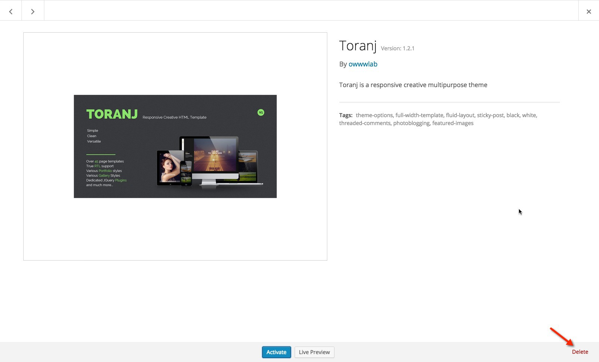

# Updating theme and plugins

In this section we are going to cover different updates way and beng notified about theme updates.

## How to get notified about updates

Each time that we release a new update, an email notification will be send to customers that are in notifying list. Go to your Themeforest account [download page](http://themeforest.net/downloads) and make sure the **Get notified by email if this item is updated** is selected for Toranj theme.

## Updating theme and plugins from WordPress admin panel

The latest version of theme and plugins are always available in your [themeforest account download page](http://themeforest.net/downloads). You need to re-download the package and unzip it somewhere on your computer.

After unzipping the package you can find the latest version of theme in “toranj theme” folder but before updating you must deactivate and delete the old verison of theme.

In order to do that please go to your _admin panel -> appearance-> Themes_ and activate any other available theme other than Toranj (Twenty Fourteen for example) and then click on Toranj theme details.

As you can see in following figure, there is a delete link at the right bottom corner of pop up:

Ok now we need to install the latest version which is available in “toranj theme” folder inside downloaded package. If you forgot the installation process refer to "installing theme and plugins" section

## Updating plugins:

We have some plugins in Toranj theme like Gallery, Portfolio and etc that might need updating as well. After installing the new version of theme you will a notification in admin panel about the plugins which needs updating.

Just follow that notificationa and make sure all plugins are updated.

## Updating theme and plugins using FTP

This one is little advanced, if you do have access to your server FTP you can overwrite the theme and plugins files directly. For uploading theme, unzip the theme file (toranj-theme-v\*.zip) and upload the toranj folder to following address on your server:

_WordPress root-> wp-content-> themes_

## Automatic Update

We recommend using **Envato Market** Plugin to benefit from automatic updates of the theme.

https://envato.com/market-plugin/